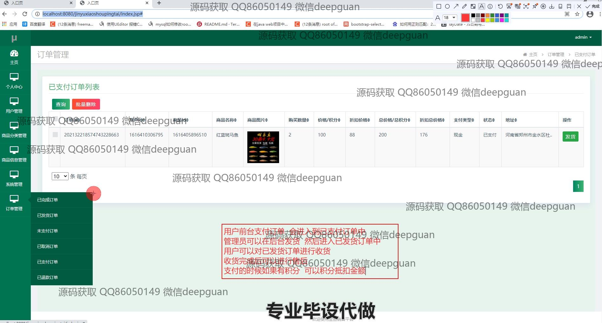

<h1 align="center">基于SSM框架的金鱼销售平台的开发和实现</h1>

## 简介
金鱼销售平台：角色分为管理员、用户；提供用户管理、商品分类管理、订单管理、商品信息管理、用户注册与登录等功能，实现金鱼的高效线上销售与管理。    --计算机毕业设计源码；毕设源码；java毕业设计源码

## 联系方式

<h3 align="center">获取完整代码与数据库文件 + 微信：deepguan QQ: 86050149 QQ群: 783742310</h3>

<h3 align="center">可帮忙远程部署 包运行成功！提供远程部署、修改代码、设计文档指导、代码讲解等服务！</h3>

## 功能介绍（完整见运行截图）
管理员：提供多模块管理功能，包括个人中心、用户管理、商品分类管理、商品信息管理、订单管理和系统管理。管理员可编辑用户信息、管理商品分类和信息，查看和处理订单信息。后台功能还包括添加、修改、上架、下架商品，以及管理库存和查看销售详情。管理员可上传首页轮播图，并接收订单状态更新与处理订单的发货操作。提供便捷的登录和角色选择功能，确保管理操作的简洁性和高效性。

用户：具备注册、登录和使用个人中心的功能。用户可以编辑和保存个人信息，包括账号、昵称、联系方式等，管理收货地址以及注册新账户。商品浏览支持查看商品详情、图片、价格、可获积分等，用户可添加商品至购物车或直接购买。订单页面展示商品信息和状态更新，用户可以跟踪订单进度。网站设计旨在提供直观的购物体验，包括主导航栏、商品详情页和支付确认页面，支持用户进行高效、安全的购物操作。

## 运行截图

本代码来源于网络,仅供学习参考使用!

